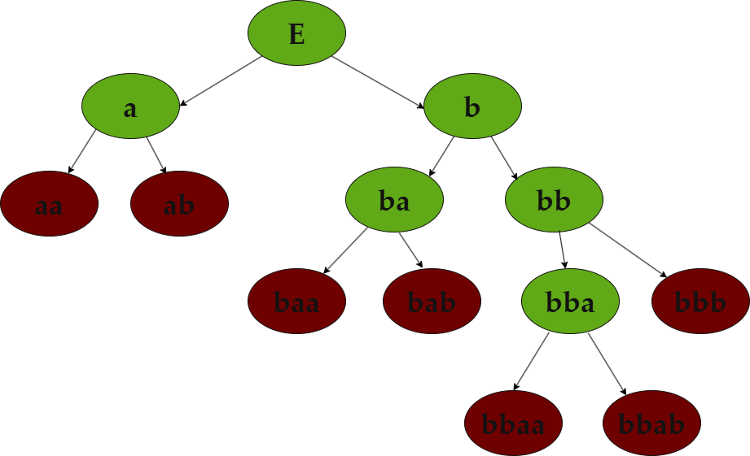

# Отчёт по Лабораторной работе 1

## Задание

По имеющейся **SRS** требуется определить:

* **Завершимость**.
* **Конечность классов эквивалентности по НФ**
  (для эквивалентностей считаем, что правила применяются **в обе стороны**).
  Если классов конечное число — построить **минимальную** систему переписывания, им соответствующую.
* **Локальную конфлюэнтность** и **пополняемость по Кнуту–Бендиксу**.

---

## Исходная система правил (SRS)

```text
aaa → aaab
aabb → abab
aa → aba
aaab → ab 
bbb → baaaa
```

---

## 1) Завершимость

Нетерминируемость данной SRS доказывается одним конкретным **циклом** (значит существует бесконечное переписывание).

Используемое правило:

* `aaa → aaab`


Возьмём слово `aaa`. Тогда имеем бесокнечный цикл:

```text
aaa  →  aaab 
aaab  →  aaabb
aaabb  →  aaabbb
aaabbb  →  aaabbbb
aaabbbb  →  aaabbbbb
...
```

Следовательно, последовательность можно повторять бесконечно (в каждой строке сохраняется подстрока `aaa`).

**Вывод:** система переписывания **не терминируема (незавершаема)**.

---

## 2) Конечность классов эквивалентности по НФ

**Введём фундированный порядок shortlex (армейский):** сначала сравниваем длины, при равной длине — лексикографически (a<b).

**Ориентация правил под shortlex.** Используем следующий набор направлений (для убывания по shortlex два правила берём в обратную сторону относительно исходной SRS):

```
aba ←→ aa            // переориентация
aaab ←→ ab 
aaab ←→ aaa          // переориентация
abab ←→ aabb         // переориентация
baaaa ←→ bbb         // переориентация
```

**Дерево-доказательство.** Построено порождающее дерево слов от ε: рёбра — дописывание `a`|`b`.
Раскраска: зелёные — НФ (ни одно ориентированное правило неприменимо), красные листья — переписываются в уже встречавшиеся листья и не дают новых НФ.

На внешней границе дерева появляются только краснык листья — новых зелёных узлов нет. Следовательно, множество НФ **конечно**, значит и число классов эквивалентности по НФ конечно.


---

# 3) Локальная конфлюэнтность и пополняемость (Кнут–Бендикс)

Берём фундированный порядок из п. 2.

## 3.1 Локальная конфлюэнтность: контрпример (до пополнения)

Есть незамыкаемый локальный пик:

```
aaab ⇒ ab
aaab ⇒ aaa   
```

`ab` и `aaa` — короткие НФ и не сводятся друг к другу. Следовательно, система **локально не конфлюэнтна** без пополнений.

